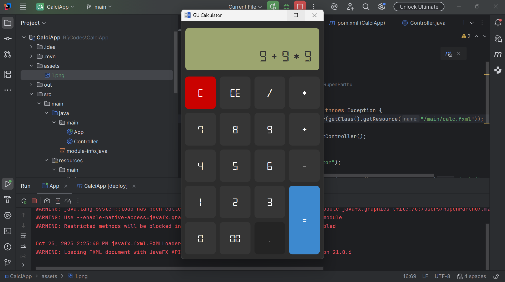

# Simple JavaFX Calculator 🧮

A basic calculator application built using Java and the JavaFX framework. It performs fundamental arithmetic operations in a clean, desktop-friendly graphical user interface (GUI).

## 🛠️ Technology Stack

* **Language:** Java
* **GUI Framework:** JavaFX
* **Build Tool :** Maven (for managing JavaFX dependencies)

## 📸 Screenshots

